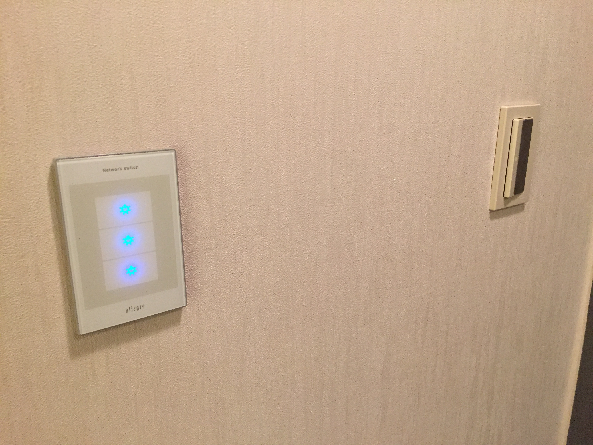
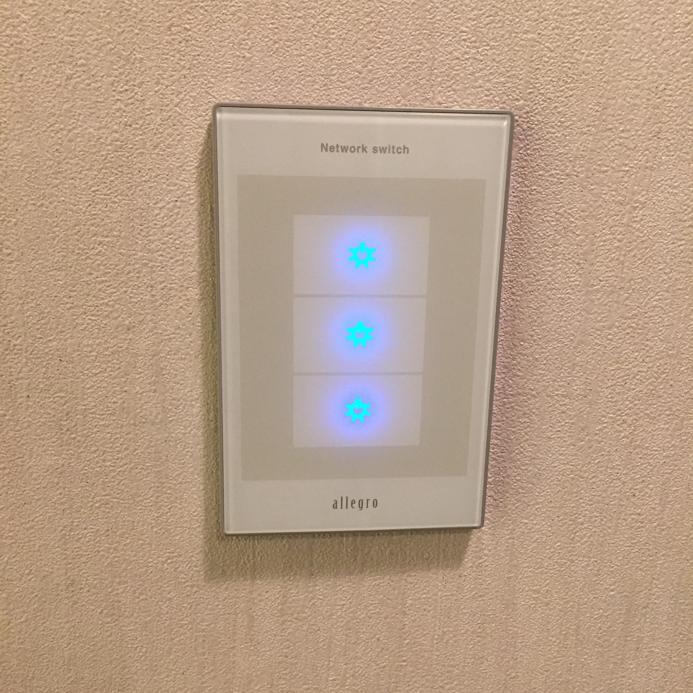
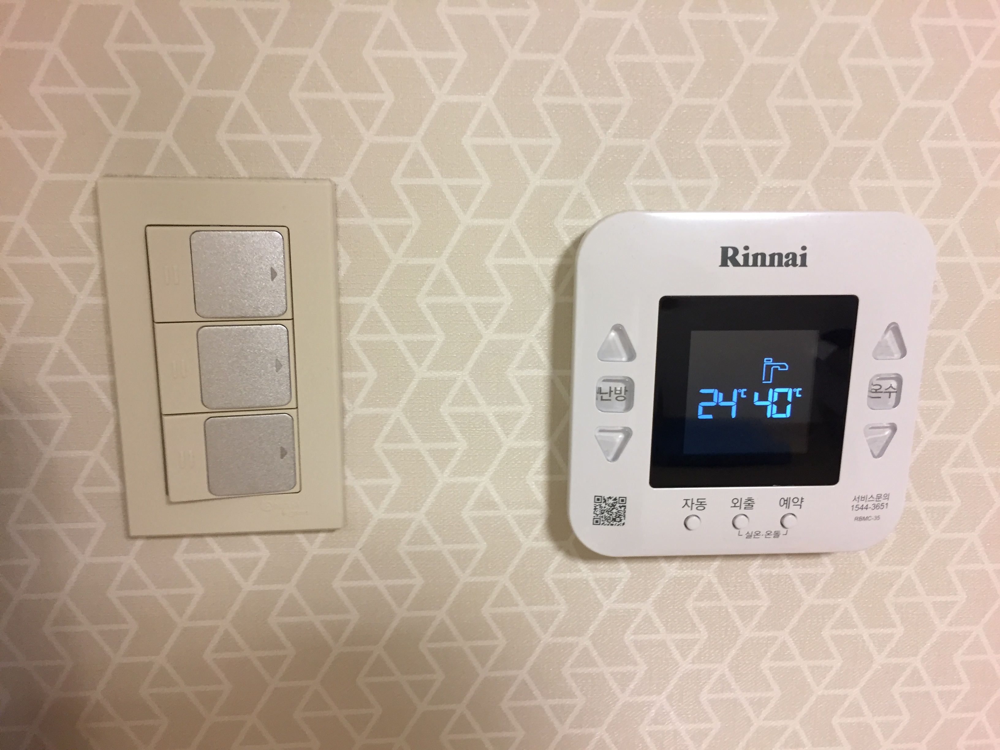

## Lights

When you enter the room, you will see two light switches on your right side.  
Left one for the bathroom, the other for whole room.

**Bathroom switch**
- 1 : main light
- 2 : shower booth light
- 3 : ventilation fan
  

**Room switch** (This one locates next to the closet)
- 1 : main light (1)
- 2 : main light (2)
- 3 : kitchen light
